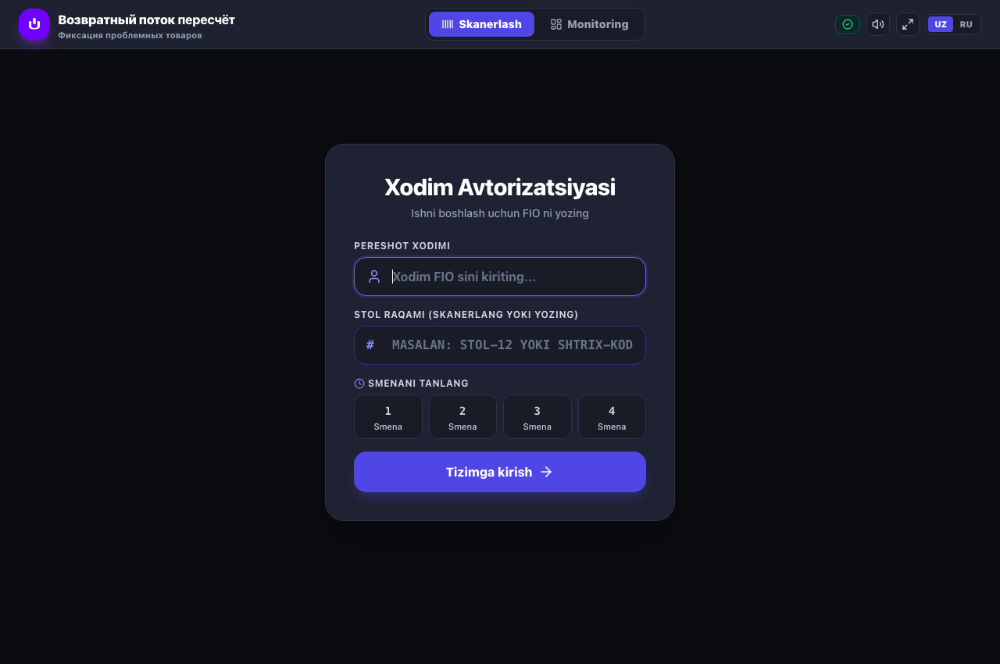
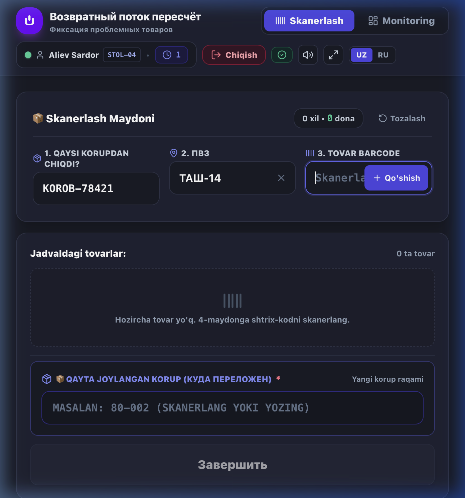
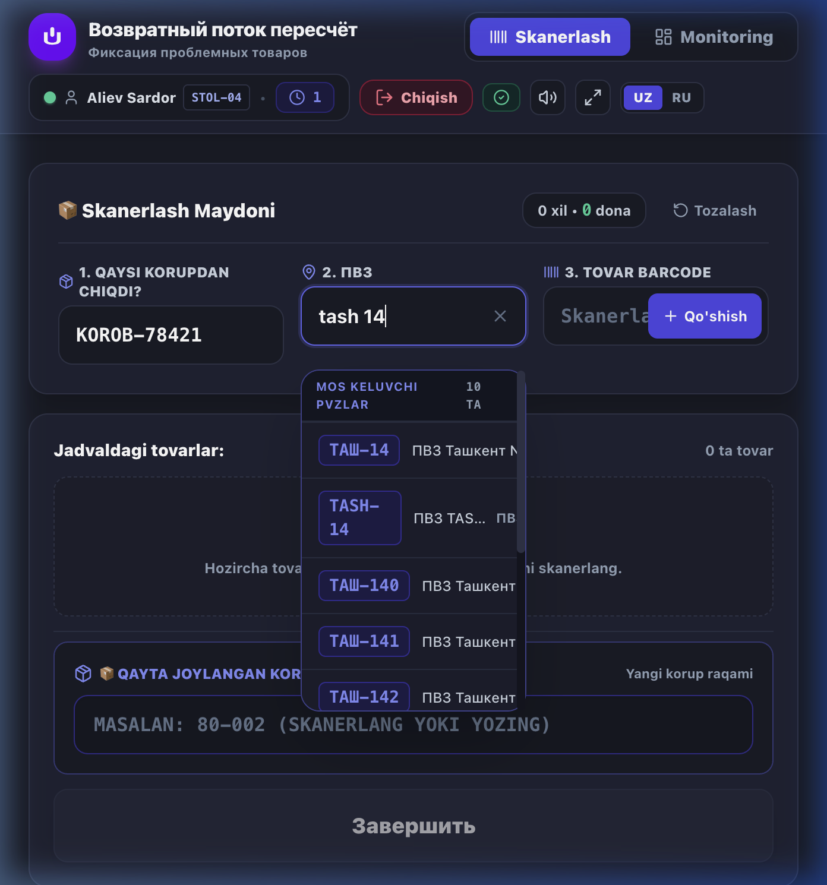
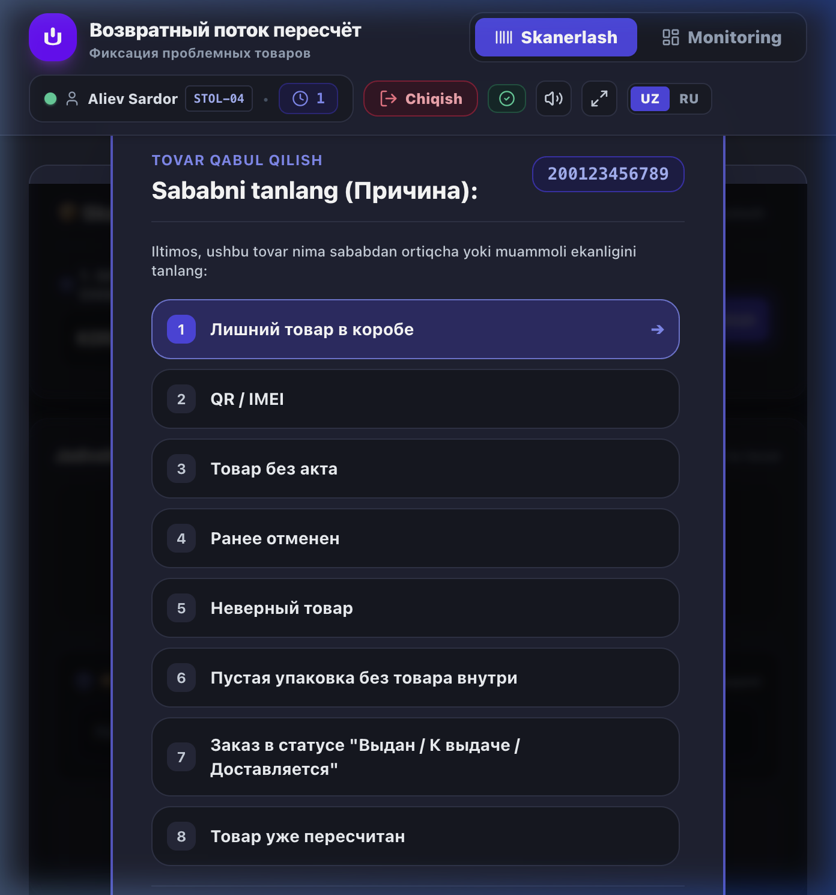
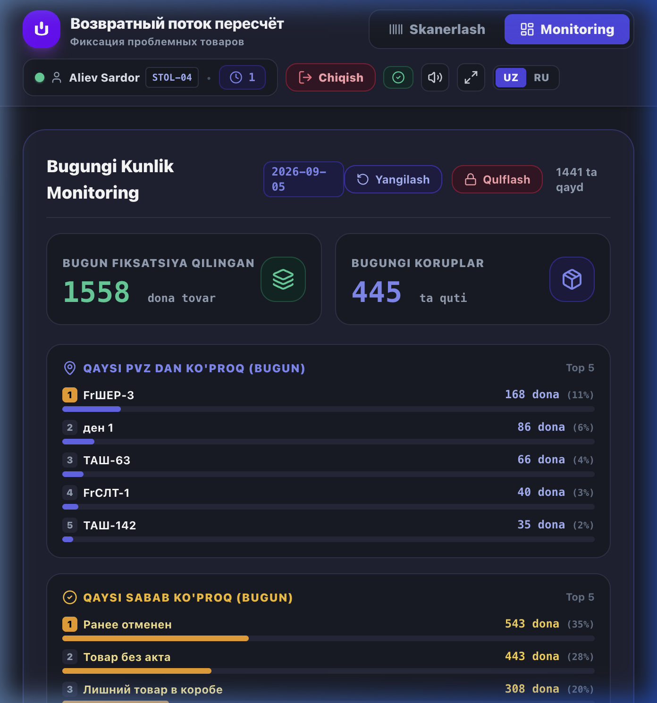

# 📖 Инструкция оператора: ВП Пересчёт — Фиксация проблемных товаров

Подробное практическое руководство для операторов сортировочных столов, бригадиров и старших смен участка **Возвратного потока (ВП Пересчёт)**.

---

## 📑 Содержание
1. [Авторизация и вход в систему](#1-авторизация-и-вход-в-систему)
2. [Порядок работы на сканировочном столе](#2-порядок-работы-на-сканировочном-столе)
3. [Умный поиск ПВЗ (2 464 пункта Uzum)](#3-умный-поиск-пвз)
4. [Регламентные причины расхождений (8 причин)](#4-регламентные-причины-расхождений)
5. [Раздел онлайн-мониторинга (Доступ по паролю)](#5-раздел-онлайн-мониторинга)
6. [Правила безопасности и горячие клавиши](#6-правила-безопасности-и-горячие-клавиши)

---

## 1. Авторизация и вход в систему

Каждый оператор перед началом работы открывает свою рабочую сессию:

1. **ФИО сотрудника:** Введите свои имя и фамилию (например, `Алиев Сардор`).
2. **Номер стола:** Введите номер рабочего места вручную или отсканируйте штрих-код стола (например, `STOL-04`).
3. **Выберите смену:** Нажмите кнопку своей смены (`1`, `2`, `3` или `4`).
4. **Войти в систему:** Нажмите кнопку входа для перехода к рабочему экрану.

> ⏰ **Важно (Автоматическая пересменка):** В **09:00** (утренняя пересменка) и в **21:00** (вечерняя пересменка) система автоматически завершает сессию. Это сделано для исключения ошибок и разделения статистики между дневной и ночной сменами.

---

## 2. Порядок работы на сканировочном столе

Интерфейс спроектирован для максимальной скорости и исключения механических ошибок:

### Пошаговый алгоритм:
1. **Поле 1. Из какого Грузоместа вышел? (Номер Грузоместа)**  
   Отсканируйте штрих-код грузоместа/короба, который в данный момент пересчитывается (например, `85-000...` или `KOROB-78421`).
2. **Поле 2. ПВЗ (Пункт выдачи):**  
   Введите или найдите код ПВЗ, к которому относится возврат (например, `ТАШ-14`).
3. **Поле 3. Штрих-код товара:**  
   Отсканируйте штрих-код товара лазерным сканером. Прозвучит подтверждающий сигнал, и на экране автоматически откроется окно выбора причины.
4. **Поле 4. Выбор причины (Причина):**  
   Выберите подходящую причину из списка. Товар моментально добавится в таблицу текущего короба.
5. **Поле 5. Куда переложен товар? (Итоговый короб):**  
   Отсканируйте штрих-код нового короба. Система принимает строго короба, начинающиеся на **80** или **85** (например: `80-002` или `85-001`). Любые другие номера блокируются.
6. **Кнопка «Завершить»:**  
   После обработки короба нажмите кнопку **Завершить**. Все строки будут отправлены и зафиксированы в общей Google Таблице.

---

## 3. Умный поиск ПВЗ

В систему загружена официальная база из **2 464 ПВЗ Uzum**. Поиск работает с автокоррекцией и транслитерацией:

* **Ввод на латинице:** Если ввести `tash 14` или `tash-14`, система первым результатом предложит `ТАШ-14`.
* **Быстрый поиск по городу:** Введите `kkd` ➔ появятся `ККД-1`, `ККД-2`; введите `mrg` ➔ `МРГ-1`.
* **Поиск только по номеру:** Введите `14` ➔ отобразятся все пункты с номером 14 (`ТАШ-14`, `СМК-14`, `ФЕР-14` и т.д.).
* **Франшизы и новые пункты:** Поддерживается поиск по префиксам `fr` (`FrТАШ`, `FrККД`) и `ipnew`.
* **Управление с клавиатуры:** Используйте стрелки **↓** и **↑** для перемещения по списку и клавишу **Enter** для выбора.

---

## 4. Регламентные причины расхождений

При сканировании товара выбирается одна из 9 утвержденных причин:

| № | Наименование причины | Описание ситуации |
|---|----------------------|-------------------|
| **1** | **Лишний товар в коробе** | Товар фактически присутствует в коробе, но отсутствует в накладной / акте |
| **2** | **QR / IMEI** | Не считывается, поврежден или не совпадает QR-код / IMEI маркировки |
| **3** | **Товар без акта** | Товар поступил без сопроводительного возвратного акта |
| **4** | **Ранее отменен** | Заказ по данному товару был отменен ранее в системе |
| **5** | **Неверный товар** | В коробе обнаружен другой товар вместо заявленного |
| **6** | **Пустая упаковка без товара внутри** | Обнаружена вскрытая упаковка/пакет без содержимого |
| **7** | **Заказ в статусе "Выдан / К выдаче / Доставляется"** | Товар по статусу числится выданным покупателю или в доставке |
| **8** | **Товар уже пересчитан** | Товар уже проходил процедуру фиксации и пересчета ранее |
| **9** | **Недокомплект** | В комплекте товара отсутствуют обязательные комплектующие или части |

---

## 5. Раздел онлайн-мониторинга

Вкладка «Monitoring» предназначена для контроля эффективности смены и оперативного анализа расхождений:

### Доступные метрики:
* **Показатели сотрудников (Рейтинг выработки):** Рейтинг каждого сотрудника по количеству зафиксированных товаров, коробов, средняя выработка на короб, % доля в смене и время последней активности (с медалями 🥇 1, 🥈 2, 🥉 3 место).
* **Фильтр периода:** Переключение аналитики между «☀️ Сегодня» и «📅 Все время», а также поиск по ФИО сотрудника или номеру стола.
* **Зафиксировано товаров:** Общий объем зафиксированных единиц.
* **Обработано коробов:** Количество пересчитанных тар.
* **Топ проблемных ПВЗ:** Рейтинг пунктов выдачи, из которых поступило больше всего расхождений.
* **Топ причин:** Процентное соотношение причин расхождений.

### Безопасность:
* Доступ к вкладке защищен паролем: **`Sardor 12345`**.
* **Автоблокировка:** При отсутствии активности в течение 2 минут или переключении на другую вкладку браузера мониторинг автоматически блокируется.

---

## 6. Правила безопасности и горячие клавиши

1. **Работа со сканером:** Программа поддерживает любые стандартные лазерные и фото-сканеры штрих-кодов с суффиксом Enter.
2. **Сброс зависшего ввода:** При случайном сканировании мусорных данных используйте штрих-код с командой `$BT#CLEAR`.
3. **Смена языка:** Кнопка переключения `UZ / RU` в верхнем правом углу позволяет мгновенно изменить язык интерфейса.
4. **Работа без интернета:** При временном отключении сети фиксации сохраняются в локальной памяти браузера и автоматически отправляются в Google Таблицу при восстановлении связи.
